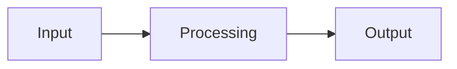

# Introduction to Python and IPO Model

Welcome to the Introduction to Python course, where we will discuss the IPO model and its application to programming. The IPO model is a fundamental concept in programming that describes the flow of data within a program. The model consists of three main components: Input, Processing, and Output. In this lesson, we will discuss these components and their implementation in Python.

>[!info] Program
> A set of instructions written in a programming language that a computer can interpret and execute to perform a specific task or solve a problem.


# IPO Model - Input, Processing, Output

The IPO model describes the flow of data within a program. The input component involves receiving data or information from external sources, such as user input, files, or databases, and storing it in variables for processing. Processing involves performing operations on the input data to produce an output, such as calculations, data manipulation, or running algorithms. Output involves returning the processed data to the user or saving it to an external source, such as a file or database.

>[!info] Database
> A structured collection of data that is stored and organized in a way that allows efficient retrieval and manipulation of the data.

>[!info] User input
> Any data or information entered by the user of a program or system that is used as input for processing. Examples of user input include mouse clicks, keyboard entries, and touchscreen gestures. For now, we will only be looking at keyboard entries as user input.




This flowchart shows the three main components of the IPO model and their relationship to each other. Data is inputted into the program, processed in some way, and then outputted to the user or saved to an external source.

# Examples

## Displaying Text

Let's apply the IPO model to Python to better understand it. We will start by focusing on the "Output" component. To demonstrate the "Output" part of the IPO model, we will use the print function in Python to display the text "Hello World" on the screen.

Here is the code that demonstrates the use of `print` function to display the text "Hello World" on the screen:
```python
print("Hello World")
```

When this code block is executed, it will output the text "Hello World" on the screen. The print function in Python is used to display text or other values on the screen. It takes one or more arguments inside the parentheses and displays them on the screen. In this case, we have passed the string "Hello World" as an argument to the print function, which will output it on the screen.

> [!info] Function
> A function is a reusable block of code that performs a specific task. Functions help to organize code and make it more modular, which can simplify development and maintenance. For example, the `print()` function in Python is a built-in function that displays text or other values on the screen. It takes one or more arguments inside the parentheses and outputs them on the console.

> [!info] Argument
> An argument is a value or reference that is passed to a function or method. For example, the print() function in Python takes one or more arguments inside the parentheses and displays them on the screen. The arguments can be strings, variables, or expressions. Providing arguments to a function or method allows it to perform a specific task with customizable input values. The number and type of arguments needed by a function or method depend on the implementation of that function or method.

### Challenges
1. Write a program to print out your name.
2. Same as Challenge #1, but use single quotes.

## Displaying Numbers

Just like we display text on the screen, we can also display numbers.

```python
print(5)
```

### Challenges
1. Print out different numbers.
2. Print out a number with a decimal point. e.g. 3.14.

## Math

We have seen how to output data to the screen. Let's now look at the "Processing" part of the IPO model in Python. We will demonstrate this by performing arithmetic operations using the arithmetic operators  `+`, `-`, `*` and `/`.
```python
print(2 + 3)
print(3.14 * 2)
print(9 / 3)
```

> [!info] Arithmetic Operator
> In Python, an Arithmetic Operator is a symbol that performs an action on values. For example, the + operator adds two values, the - operator subtracts one value from another, the * operator multiplies two values, and the / operator divides one value by another. These operators can be used with different types of values, such as numbers or strings, to produce a result.


### Challenges
1. Try some more math operations using `+`, `-`, `*` and `/`.
2. Try math on more than 2 numbers.
3. Try math on more than 2 operators. 

## Joining Text

Joining text is the process of joining two or more texts together to form a single, larger text. In Python, we can join texts using the `+` operator. For example:

```python
print("My name is" + " " + "John" + " " + "Doe")
```

The above code is a Python statement that concatenates multiple pieces of text to form a longer sentence, which is then displayed on the screen.

> [!info] Concatenation
> In Python, concatenation is the process of combining multiple pieces of text or data together to form a single piece of text or data. In the context of text, concatenation involves joining two or more pieces of text into one longer piece of text.
> 
> In Python, the `+` operator can be used to concatenate two or more pieces of text (represented as text literals) together. When the `+` operator is used with text, it joins the pieces of text together in the order they are given. For example, `"Hello" + " " + "world"` would concatenate the pieces of text `"Hello"`, `" "`, and `"world"` to produce the longer piece of text `"Hello world"`.

The `print()` function is used to output the final sentence to the screen. It takes one argument, which is the text that needs to be displayed. In this case, the text is generated by concatenating several pieces of text using the + operator.

The pieces of text being concatenated are enclosed in quotes to indicate that they are string literals. The first piece of text is "My name is", followed by a space (represented by the " "), then "John", another space, and finally "Doe". The spaces are needed to separate the different words in the sentence and make it more readable.

The `+` operator is used to concatenate the different pieces of text together. Without the spaces, the sentence would be displayed as "My name isJohnDoe", which would be difficult to read. By including spaces between the words, the sentence becomes more human-readable, and the output becomes "My name is John Doe".

## Challenges
1. Substitute "John" and "Doe" for your first and last name.
2. Construct 2 more sentences from its parts. e.g. concatenate "The quick brown fox" and "jumps over the lazy dog."

## Variables

Variables are named storage locations that hold a value, and they can be used to store and manipulate data in a program. For example:

```python
name = "John"
print(name)
```

This code will display "John" on the screen. By using variables, we can create more dynamic and flexible programs that can store and manipulate different data values.

### Challenges
1. Change "John" to your name.
2. Create a new variable called `age` and assign it the value of your age.


## Input

### Using input() in Python

The input function allows users to provide data to the program at runtime, making the program more versatile and user-friendly. It displays a prompt message, waits for the user to enter a value, and returns it as text. We can join text to display personalized messages that include the user's input. For example:


```python
name = input("Enter your name: ")
print("Hello, " + name + "!")
```

This code will prompt the user to enter their name, and then display "Hello, [name]!" on the screen.

## Exercise

### Madlibs Generator

You have been tasked with creating a Madlibs generator program in Python. Your program should ask the user for several inputs such as nouns, adjectives, and verbs, and then generate a silly and humorous story by inserting those inputs into a pre-defined template.

#### Requirements:
- Ask the user to input several words such as nouns, adjectives, and verbs.
- Use the user's inputs to fill in the blanks of a pre-defined Madlibs template.
- Display the completed Madlibs story to the user.

#### Example:
Here's an example Madlibs template:

> "The {noun1} was so {adj1} that it decided to {verb1} all the way to the {noun2}. When it got there, it was {adj2} and decided to {verb2} instead."

And here's what the completed Madlibs story might look like based on the user's inputs:

> "The pizza was so cheesy that it decided to dance all the way to the moon. When it got there, it was exhausted and decided to sing instead."

Your task is to write a Python program that implements this Madlibs generator, following the requirements listed above. Have fun with it and be creative!